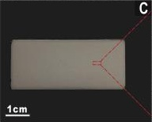

# Separating images from multiple merged images

## Introduction
When the image we want is combined with several images in one image, there are cases where we want to get only the image we want.
It's not difficult when the amount of images you want to get is small, but when the amount of images that humans cannot execute, it's impossible to get the image you want.
So, we propose a code that can easily get the image you want.

## Requirements
* Python >= 3.6.13
* opencv >= 4.6.0

## Getting Started

### Installation
* Clone this repo:
```
git clone https://github.com/hmnd1257/Separate_Figures.git
cd Separate_Figures
```

## Run
1. Our dataset structure
    * This is the dataset structure we used.
```
dataset/
    |____XXXX.jpeg # [.png, .jpg] format is also acceptable.
    |____OOOO.jpeg 
    |____....
```
2. Run
    * If the save path doesn't exist, it is automatically created.
```bash
# in <path-to-this-repo>/
python main.py --baseroot './dataset' --contour './results/contour' --ROI './results/ROI'
```

## Run on your own dataset
Step 1: Download your own images datasets.<br />
Step 2: Open `main.py` in python idle.<br />
Step 3: Modify Arguments to set baseroot, contour, ROI and other parameters.<br />
Step 4: Run `main.py`


**Example**: If you leave the other settings as default except for the path option, run the following command. :
```bash
# in <path-to-this-repo>/
python main.py --baseroot <your_image_baseroot> --contour <cnt_save_path> --ROI <ROI_save_path>
```

**Arguments**
* `<baseroot>` (required): path to the dataset directory.
* `<contour>` (required): path to the save contour image directory.
* `<ROI>` (required): path to the save separated image directory.
* `<padding>` Add a white background with padding technique to better find the Region of interest (default: True).
* `<pixel>` Sets the padding size (default: 10).
* `<extension>` When saving a separated image, the extension of the image is set (default: .jpeg).


<table style="float:center">
 <tr>
 <th><B>Input</B></th>
 </tr>
  <td>
   </td>
  </td>
</table>

<table style="float:center">
 <tr>
 <th><B>Output</B></th>
 </tr>

 <tr>
  <th>
  <B>Contour image</B>
  </th>
  <td>
  
  </td>
 </tr>
  <th>
  <B>Separated image</B>
  </th>
  <td>
  
  </td>
  <td>
   
  </td>
  <td>
   
  </td>
  <td>
   
  </td>
</table>

## Example results

* Input
<br>

This is the input image.
<tr>
<td></td>
</tr>

* Output
<br>

This is the contour image.
<br>
<tr>
<td></td>
</tr>

This is a separate image.
<table style="float:center">
<tr>
<td></td>
<td></td>
<td></td>
<td></td>
</tr>
</table>


